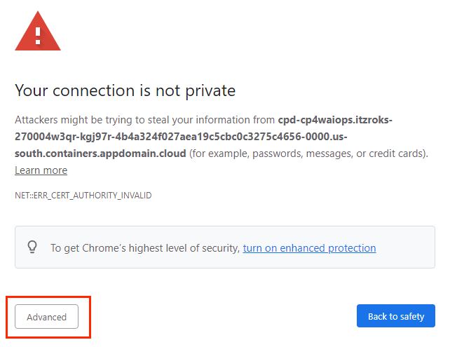

--- 
title:  Efficiently automate infrastructure via Watson AIOps
description - Think Lab 1187:  Efficiently automate infrastructure via Watson AIOps
---

## Introduction

This lab will focus on leveraging the Automation component of the Cloud Pak for Watson AIOPs to improve your efficiency by automating some of the tasks 
that your organization may be executing manually.

The lab consists of a few different exercises that will allow you to understand the capabilities to automate key tasks.  Each section of the lab is intended to be independent and 
can be executed in any order.  The lab exercises include:
- Provision a virtual machine into the IBM public cloud using the service library.  
    In this section, you'll learn how to provision a VM, publish a service to the service library, and modify a service to add additional capabilties.
    One of the key capabilities is how the "manage services" allow you to combine tools like Terraform and Ansible Tower to achieve more complex automations.
    Complex workflows can be achieved via the Composition page and you'll learn how to use the drag and drop capabilities.
- Provision a virtual machine into a VMware environment using the service library.
    In this section, you'll learn how Terraform is leveraged to provision the virtual machine to the public cloud and how parameters are defined and 
    exposed in the service. You'll also see how tags can be defined in the virtual machines and used for other activities such as chargeback reports.
- Use Infrastructure Management view detailed information about your containerized environments and setup chargeback reports

## Logging into the Environment

  Before beginning the exercises, take the following steps to login to the soleil environment and access the lab environment.

  After opening your browser and logging into the lab, you'll see an image of a computer.  You will login to this virtual machine and launch a browser to access the lab environment.

  If the background is green, it means the virtual machine is running.  If it is not running, click the start arrow to start the VM
  
  Once the Virtual Machine is running, click on the picture of the computer to open the desktop.

  

  If prompted, the login password for the virtual machine is **"Passw0rd"**

  For more information on using the soleil environment, scroll towards the bottom of the page.

  After logging into the virtual machine, launch the Chrome browser.  When Chrome opens, 3 tabs will automatically open.  
  - The first tab is the lab guide.
  - The 2nd tab is the Automation component of the Cloud Pak for Watson AIOPs.
  - The 3rd tab contains a list of student usernames and passwords.  

  Then, go to the 3rd tab and lookup your username and password.  
  
  Use that username and password to log into the Automation tools within CP4AIOps.  

  When logging in, you will see multiple types of authentication.  Select **Enterprise LDAP** as your authentication mechanism.   
  

  After selecting **Enterprise LDAP**, you may see a warning that your connection is not private. This is due to the fact that we are using self-signed certificates.  When you receive this warning, scroll to the bottom of the page and click on the **Advanced** button.
   

  Then, at the very bottom of the page, click on the link.
  

  Then you will see the login prompt asking for your **username** and **password**.

  Using the information from the 3rd tab in your browser, specify your **username** and **password**.

## Begin the Exercises

After completing the Login section, use the other links to go directly to one of the lab exercises.  The exercises can be run in any order.

Select one of the lab exercises in the upper left corner or select one of the images below.

<Row>

<Column colLg={4} colMd={4} noGutterMdLeft>
<ArticleCard
    color="dark"
    subTitle="Automation with VMware"
    title="Want to learn how to automate infrastructure management in VMWare vSphere?"
    href="/tutorials/vmware"
    actionIcon="arrowRight"
    >

</ArticleCard>

</Column>

<Column colLg={4} colMd={4} noGutterMdLeft>
<ArticleCard
    color="dark"
    subTitle="Automation with the Public Cloud"
    title="Want to learn how to automate infrastructure management in Public clouds?"
    href="/tutorials/ibmcloud"
    actionIcon="arrowRight"
    >

</ArticleCard>
</Column>

<Column colLg={4} colMd={4} noGutterMdLeft>
<ArticleCard
    color="dark"
    subTitle="Managing chargeback"
    title="Do you want to create and execute a chargeback report on the VM and container workloads?"
    href="/tutorials/Chargeback"
    actionIcon="arrowRight"
    >

</ArticleCard>
</Column>

</Row>

***

