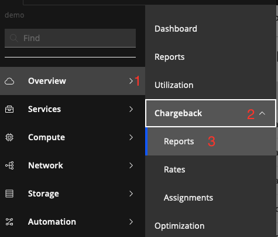
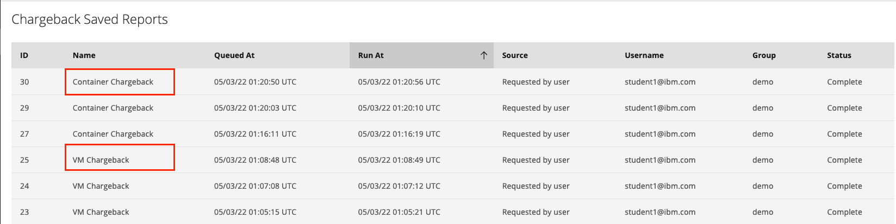
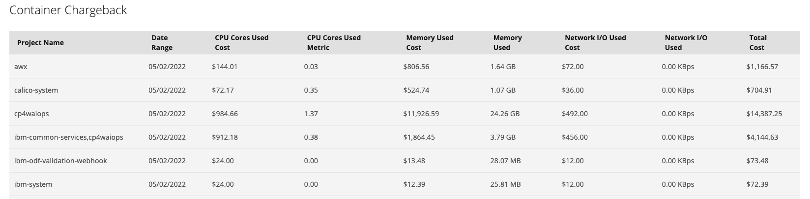
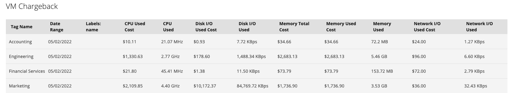
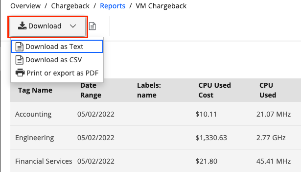
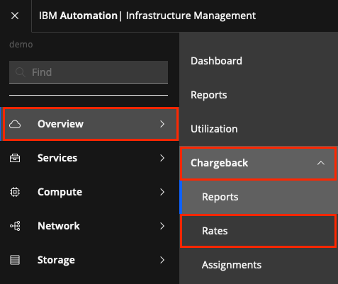
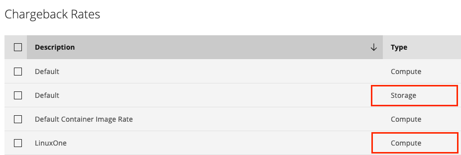
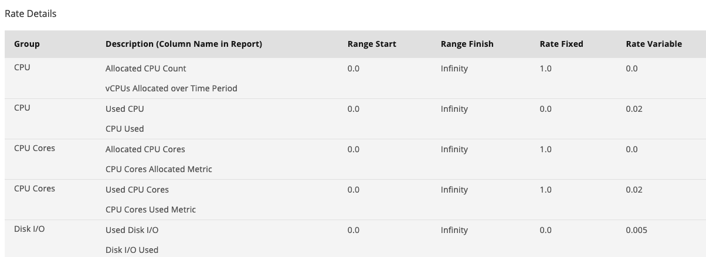
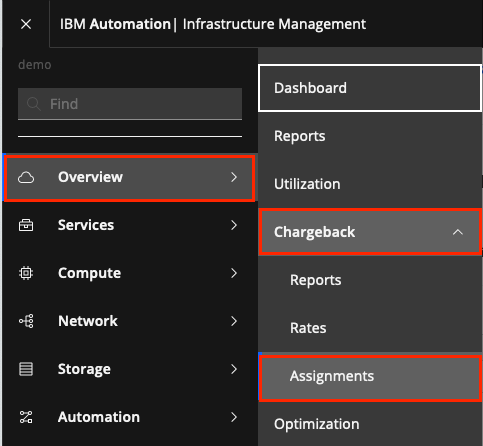
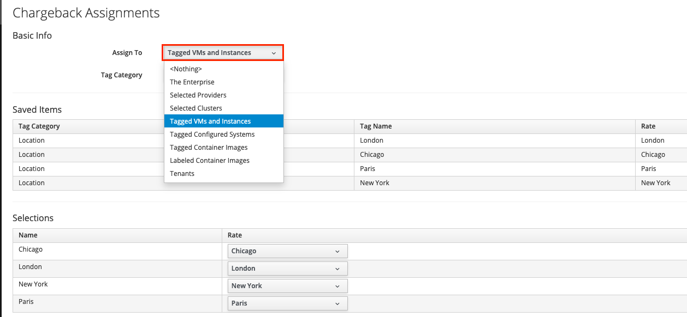

In this portion of the lab, you'll learn how to create and execute chargeback reports for virtual machines and containerized environments.  You'll also learn how to modify and assign a rate card that determines that cost of the services.
 

## Executing a chargeback report

1) Let's begin by executing an existing chargeback report.  Click the hamburger menu in the top right corner.
  

2) Then, select **Overview (1)**.  Then, select **Chargeback (2)**. Finally, select **Reports (3)**
  

You will see a page with a list of reports that have been executed.  There are two types of reports.  One is named **Container Chargeback** and the other is **VM Chargeback**.  The **Container Chargeback** report will report on the costs of the containerized workloads.  The other report is a report on the Virtual Machine Chargeback.  
  

Double Click on one of the **Container Chargeback** reports.  You'll see a list of charges for the workloads that are running on kubernetes environments.  The report is organized around the "Projects (Namespaces" running in OpenShift or Kubernetes.  In the report, you can see the usage and cost for the CPU cores, Memory, and Network utilzation.
  

Either use the Back button in your browser, or click on **Reports** in the breadcrumb at the top to navigate back to the list of reports.

Double click on one of the **VM Chargeback** reports.  In this report, you can see the usage and cost, grouped by organization, for CPU, Memory, Disk, and Network.
  

Select the **Download** button in the upper left corner and you'll see that you can download the report as Text, CSV, or PDF format.
  

Now, let's examine how the costs for the various services were determined.  The costs are defined in **Rate Cards**.  In upper left corner, select **Overview**, then **Chargeback**, then **Rates**
  

On the screen, you'll see that there are two different types of **Rate Cards**. There are **Compute** and **Storage** Rate Cards.  
  

Open one of the **Compute** Rate cards by double clicking on the entry.
  

Within the rate card, you'll see that there are rates related to CPU, Network, Memory, and more.  You'll also see that there are fixed rates and variable rates.  The fixed rates are a fixed cost
based on number of CPU cores, memory, etc. for the virtual machine. Variable rates are for charges that are based on actual utilization.  For example, if you are charged when network utilization
goes above 1 Gig per day, then you can apply a variable rate.

If desired, you can open the Storage rate card and view the options.

Now, let's examine the assignments.   Click on **Overview**, then **Chargeback** and finally **Assignments**
  

The assignments are used to assign a **Rate Card** to a set of servers and/or containers in the environment.   For example, you might have one **Rate Card** for your IBM Cloud VMs,
another **Rate Card** for your on-prem VMs, and another for your AWS VMs.

In this environment, you'll notice that we have **Rate Cards** assigned by **Tagged VMs and Instances**.  Specifically, we have chosen the **Location** tag and assigned a different rate card for each location.
  

If you want to see other options, click on the **Tagged VMs and Instances** dropdown and examine the choices.  You'll see that you do the assignments based on specific **Providers** such as IBM Cloud, VMware, or AWS.  You can 
also select **The Enterprise** which would apply a single **Rate Card** to all systems in the enterprise.

***

## Creating a Chargeback Report

Next, let's create a Chargeback Report.  For this lab, we'll create a chargeback report for containerized workloads.  In a kubernetes environment, a typical application uses a specific namespace to host the application components.  So, we are going to create a report that is grouped by the Products (or namespaces).  

1) In the navigation on the left, click on Overview -> Reports.  Note: you might think that you should navigate to Overview -> Chargeback -> Reports, but you can only run reports from that menu item.
  

2) In most cases, when you navigate to Reports, you will be in the "Saved Reports" section.  Click and expand "Reports"
  

  You will see a list of out of the box report categories and reports such as Configuration Management for Virtual Machines, Trending, Optimization, and more. 

3) Scroll to the very bottom of the "Reports" section and you'll see a folder titled "Custom". The folders will be the color blue.

  This is the section where you will create all custom reports.  You can create your own custom reports, including chargeback reports.

4) Click to select the word "Custom".  Then, select "Configuration" -> "Add a new Report" at the top of the page.
  

  A new blank report template will open.  

5) Begin filling in the details.  
  a) Give your report a Menu Name.  Use your username as part of the name so that you can find your report.  
  b) Enter a title for your report
  c) In the dropdown list for "Base the report on", choose "Chargeback for Projects".  In this context, a "Project" means that it is an OpenShift Project or Kubernetes Namespace.
    

6) Now comes the only tricky part about creating reports.  In the dropdown labeled "Available Fields", select the fields shown below.  If you want to select a slighly different list, that's fine.  Also, know that you can select "Tags" that might exist in the data, such as Department or Location.
  

7) Now for the "tricky" step.  Do NOT click the "Add" button in the bottom right corner.   Instead, click to the right of the dropdown dialog box to collapse the list.  You will see that the metrics you selected will be listed in the "Available Fields" as seen below.   Then, click on the down arrow to move the fields down to the "Selected Fields".
  

  After you have click on the down arrow, you'll see the fields listed in the "Selected Fields" box as seen below.
  

  The report will use the fields in the "Selected Fields" box and will show up in the order that you see them listed.

  You can use the up arrow to remove an unwanted fields.  Or, use the arrows on the right to reorder the fields.

  Before you save the report, you typically want to do some customization. 

8) First, click on the "Formatting" tab at the top of the screen.  You typically don't need to modify the formatting, but know that you can heavily customize the output data. For example, choose 0,1 or 2 decimal points, convert the data to exponential form, etc.
  

9) Next, click on the Filter tab at the top of the screen.
  

10) The filter tab allows you to do much more than just filtering.  It also allows you to specify the duration of the report and Grouping of the data.  Let's modify some of the default values.
  

  As shown above, change the following values:
  - Show Costs by:   "Container Project"
  - Provider:  "All Providers"
  - Group by:  Data and ContainerProject"

11) This set of selections will create a report that shows the chargeback data for container projects.  It will include the data for "All" of the providers that exist in the environment.  In the context of containers, the Provider is the Kubernetes Cluster that you are monitoring.  Finally, you are going to Group the report by date and by the Kubernetes Namespace/Project.

12) The last step is to preview your report to make sure it is correct.  Click the Preview tab.   Then, click on the "Generate Report Preview" icon to preview the report.
  

13) You will see a report that looks something like this:
  

14) Assuming the report looks correct, click "Add" in the bottom right corner to save your report.

15) Now, you can run your report.  Find your report in the "Custom" section of the Reports list.  Select your report.  Then, click the "Queue" icon at the top of the screen.  This will queue your report for execution.  

16) After you click "Queue", you will see your report in the middle of the page with a status of either "Queued" or "Running".  On the left size, you'll see "Generating Report" just below your report name.  After a period of time, the report will generate.  In order to see the status update, it is necessary to refresh the page or click away and click back.

17) Once the report has been generated, you will see the text "Generating Report" replaced by the data and time that the report was generated.
  

18) Click on the data and time to view the report.

19) If desired, you can also schedule your report to run at regular intervals.  To schedule a report, select your report in the Custom folder.  Then, select "Configuration" -> "Add a new Schedule" at the top of the screen.
  

20) The scheduling of reports is pretty straightforward.  For example, select Run "Weekly" every "Week.  Select a starting time such at 5:00 UTC.  Optionally, select to send an e-mail when the report is generated.

This concludes the section of the report on Chargeback. In this section, you've learned how to create reports, view reports generated by other people, assign rate cards, schedule reports, and more.  

To continue other portions of the lab, select one of the lab exercises in the upper left corner or select one of the images below.

<Row>

<Column colLg={3} colMd={3} noGutterMdLeft>
<ArticleCard
    color="dark"
    subTitle="Automation with VMware"
    title="Want to learn how to automate infrastructure management in VMWare vSphere?"
    href="/tutorials/vmware"
    actionIcon="arrowRight"
    >

</ArticleCard>

</Column>

<Column colLg={3} colMd={3} noGutterMdLeft>
<ArticleCard
    color="dark"
    subTitle="Automation with the Public Cloud"
    title="Want to learn how to automate infrastructure management in Public clouds?"
    href="/tutorials/ibmcloud"
    actionIcon="arrowRight"
    >

</ArticleCard>
</Column>

<Column colLg={3} colMd={3} noGutterMdLeft>
<ArticleCard
    color="dark"
    subTitle="Managing SRE console access"
    title="Do you want to learn how to provide SRE secure terminal access to Virtual Machines?"
    href="/tutorials/Console_Access"
    actionIcon="arrowRight"
    >

</ArticleCard>
</Column>

</Row>

***