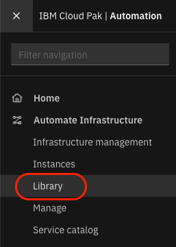
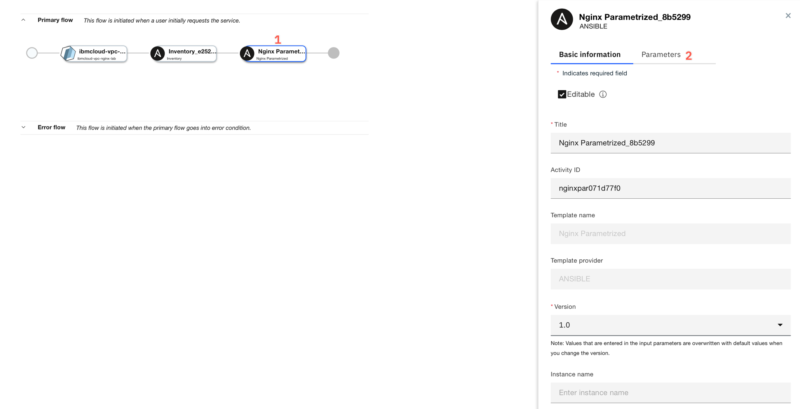

<FeatureCard title="Automating infrastructure in public clouds" color="dark">


</FeatureCard>

<AnchorLinks>
  <AnchorLink>Lab Overview</AnchorLink>
  <AnchorLink>Managing infrastructure in public clouds</AnchorLink>
  <AnchorLink>Exploring the cloud providers</AnchorLink>
  <AnchorLink>Summary</AnchorLink>
</AnchorLinks>

***

## Lab Overview

IBM Cloud Pak for Watson AIOps Infrastructure Management delivers the insight, control, and automation enterprises need to address challenges of managing hybrid cloud environments, which are far more complex than traditional data center. This technology enables enterprises with virtualization or public clouds to improve visibility and control, and operate a well-managed infrastructure.

IBM Cloud Pak for Watson AIOps Infrastructure Management is based on upstream OSS project [ManageIQ](https://www.manageiq.org) and includes the following feature sets:

- Insight: discovery, monitoring, utilization, performance, reporting, analytics, chargeback, and trending.
- Control: security, compliance, alerting, policy-based resource and configuration management.
- Automate: IT process, task, and event, provisioning, workload management and orchestration.
- Integrate: systems management, tools and processes, event consoles, CMDB, RBA, and web services.

In this tutorial, you will explore the following key capabilities:

- Understand Cloud Pak for Watson AIOps Infrastructure Automation capabilities for public clouds
- Learn how to deploy a new service in a public cloud combaning Terraform and Ansible
- Learn how to manage lifecycle of the service
- Learn how to apply configuration and control policies to the managed VMs
- Learn how Cloud Pak help SRE teams managing infrastructure in public clouds with full audit trail.

***

## Managing infrastructure in public clouds

  There are multiple technologies available to provision and manage IT services and infrastructure in public clouds. Each of them has some advantages and there is no way one can fully replace the others. This creates a real challenge for enterprises: "How to achieve consistency and traceability across all environments?". IBM Cloud Pak for Watson AIOps - Infrastructure Automation helps integrate different tools and technologies in the closed-loop management cycle.

  In the following exercise, you learn how to provision a new service in a public cloud using Terraform. You will extend the service (which initially provisions a single virtual machine) with the configuration management task driven by Ansible. Then, you will explore how tags are mapped to provide a consistent view of the resources across all infrastructure providers and how to apply the configuration policies to ensure configuration governance.

### Exploring the cloud providers

  Log in to the Cloud Pak user interface with your assigned user id (studentX). From the "hamburger" menu in the top-left corner select **Automate infrastructure -> Infrastructure management**

  

  New browser tab opens with Infrastructure management user interface. Here, depending on the assigned permissions you can view and manage virtual machines in any of the connected environments. Let's explore infrastructure in public clouds. From the left-hand side menu select **Compute -> Cloud -> Providers**

  

  You should see some public cloud regions from different public providers registered. Due to the fact, that this is a shared environment you cannot edit the providers, but you should know that IBM Cloud Pak for Watson AIOps Infrastructure Management currently supports the following clouds:

  - Amazon EC2
  - Google Cloud Engine
  - IBM Cloud
  - Microsoft Azure
  - Microsoft Azure Stack
  - Openstack
  - VMware vCloud

  

  The list will change as support for more cloud providers are added.

  Click any of the available providers (for example IBM Cloud US-East - the list may vary). You will see details of all resources provisioned in selected region (to which you have access rights assigned). You will see that you have access to the cloud flavors (templates), networks, cloud volumes, and more.  You can click on any of these to explore more details.
  
  To explore further, click the **Instances**.

  

  The exact list of resources will vary depending on the state of the environment and your permissions.
  
  

  You can click any instance to look at the details.  We recommend selecting one of the **Running** instances.

  

  Let's provision some new instances in IBM Cloud.

### Exploring the service library

  Go back to the main browser tab **IBM Cloud Pak | Automation**. This time from the "hamburger" menu select **Automate infrastructure -> Library**.
    

  In case you access this module for the first time, "Welcome" screen may pop-up. If that happens, click the **Service library** link.

  

  In the Service Library view you can see all services defined in the Cloud Pak. On the left you can see different service categories (1), on the right list of all services in a selected category (2). On top, there are additional tabs, where you can define the terraform templates for your environment (3). This tab is explored more in VMware lab. Here you will work with the already defined service.

  


  To ensure that you don't have conflicts with other students that are taking this lab, you are going to create a copy of the service that we will be using for the lab.

  Fine the serviced named **"IBMCloud-Nginx-Lab"**.  Then, select the three vertical dots on the right side and select **"Duplicate"**.
   

  A dialog will open.  Scroll to the bottom of the dialog and specify a unique name.  We recommend you prefix **"IBMCloud-Nginx-Lab"** with your student name.  For example, **"Student37-IBMCloud-Nginx-Lab"** as seen below.  Then, click the **"Duplicate"** button.
     

  You will immediately be taken to the editor for your new service.  By default, you will be editing version 1.0.0.3 of the service because that is the **default** version.

  This view shows all the details of the service. Click the **Composition** tab to see the provisioning flow.

  

  You can see that service flow includes two tasks:
  - a terraform template **ibmcloud-vpc-nginx-lab** (1), and
  - Ansible inventory task (2)
  - Nginx parameters task (3)

  

  First task provisions a terraform template in IBM Cloud (To see the source code of the template click this [link](https://github.com/dymaczew/cmh-test-github/tree/master/terraform/ibmcloud-vpc-nginx-lab)) When it completes, the second one registers newly provisioned VMs in Ansible Tower inventory so you can run the configuration tasks against them. 
  
  Let's add a new Ansible task to the flow to configure new virtual machine as web server running Nginx.   

  Unfold the **"Ansible"** tasks on the left side (1 and 2).  Then, drag the **Nginx Parameterized** Ansible template to the right side of the **Ansible Inventory** task and let go of the mouse when you see a small square appear and it turns yellow.
    

  This is a very simple Ansible playbook available [here](https://github.com/dymaczew/rba-ansible-sample/blob/master/nginx_parametrized.yaml), which was imported into connected Ansible Tower and exposed as a Template (All templates  you create in connected Ansible Tower are automatically shown in the Service Editor). For covenience, the source code was also shown below:

  ```yaml
    ---
    - name: Install nginx
      hosts: all
      gather_facts: False
      become: true

      vars:
       - MyMessage: "Welcome to Infrastructure Management Lab instance!"

      tasks:
      - name: Add epel-release repo
        yum:
          name: epel-release
          state: present

      - name: Install nginx
        yum:
          name: nginx
          state: present

      - name: Insert Index Page
        template:
          src: index.html.j2
          dest: /usr/share/nginx/html/index.html

      - file:
          path: /usr/share/nginx/html/index.html
          mode: 0644

      - name: Start NGiNX
        service:
          name: nginx
          state: started
  ```

  Click the newly added task to and click on the **Parameter** tab to edit the parameters.

  

  There are three parameters available:

  - inventory name
  - credentials
  - extra variables (to be passed to Ansible playbook)

  Click **inventory_name** link (1) and then click **Link parameter** (2).

  

  Instead of providing the static value, you will link as input the output value from the previous **Ansible inventory** task. Pick **Ansible** (1) and unfold the **Inventory** task parameters (2).

  

  Scroll down and select **inventory_name (output)** (1). To create a linkage click the '+' sign next to the parameter name. Then, click **Save** (2).

  

  As a second required parameter **credential_name** provide the static value "default-ssh-key" and click **Save**. In our lab setup, each virtual machine is provisioned with SSH key embedded in a template, and Ansible Tower that is used for automating the configuration tasks, has a matching private key stored with this name. Alternatively, you could add **Ansible Credentials** task in the flow to create a credentials dynamically, but we wanted to simplify the flow for the time sake.

  

  Finally, we want to customize the Nginx default web page with personalized message. Ansible template contains variable MyMessage that can be overriden on runtime. To pass custom value click **extra_variables** (1) and then **Add**.

  

  In the newly open map field provide the following values:
  
  - Key field: **MyMessage** (1)
  - Value field: **${input_parameters.message}** (2)
  
  Then click **Save** (3)

  

  The value field refers to the parameter name that allows users to provide the value during service request. 
  
 Notice that a parameter named "message" already exists as an input paramter.  This value will be mapped to the Ansible template parameter that you just created.

  

Click the **Save** button on the top (1). Then, click "three dots" (2) icon next to Publish button and select **Test deploy** (3).

  

  Provisioning dialog opens. Click **Next**.

  

  Provide the required parameters. Select any **Namespace** (e.g. `default`) (1)- this is used for access control but we won't explore that in this exercise. For **Service instance name** (2) provide a unique name (for example your user id - this will help you identify your instance among all VMs provisioned by other students). You can change **Environment** type (3) - that will be dynamically mapped to the filters in the Infrastructure management UI. Provide the personalized **Welcome message** to be shown by Nginx server (4). Finally hit **Deploy** button (5).

  

  On the Order confirmation dialog select **Go to instances** to verify the provisioning process.

  

  Click the row with your service instance.

  

  You should see your tasks progressing. You can click **Log file** tab to see the detailed log from each activity.

  

  If everything works as expected, at the end of terraform provisioning log you should see the public IP of newly provisioned service.

  

  **NOTE:** If something goes wrong and you receive Error look through the logs to find the problem and ask Instructor for help. If you want to remove the failed instance of your service, first select **Terminate** to remove any provisioned resources and then select **Delete** from service instance actions.

  If the service is **Active** (with green dot next to it), you can point a new browser tab to see if you can connect to your new service instance.

  

  Congratulations! You have just provisioned new service in public cloud with Terraform template and configured application service there (Nginx web server) with Ansible task.

***

## Summary

  In this exercise you have modified the service definition to combine provisioning of infrastructure in public cloud using Terraform template with the configuration task leveraging Ansible playbook. 


To continue other portions of the lab, select one of the lab exercises in the upper left corner or select one of the images below.


<Row>

<Column colLg={3} colMd={3} noGutterMdLeft>
<ArticleCard
    color="dark"
    subTitle="Automation with VMware"
    title="Want to learn how to automate infrastructure management in VMWare vSphere?"
    href="/tutorials/vmware"
    actionIcon="arrowRight"
    >


</ArticleCard>

</Column>


<Column colLg={3} colMd={3} noGutterMdLeft>
<ArticleCard
    color="dark"
    subTitle="Managing chargeback"
    title="Do you want to create and execute a chargeback report on the VM and container workloads?"
    href="/tutorials/Chargeback"
    actionIcon="arrowRight"
    >


</ArticleCard>
</Column>

</Row>
